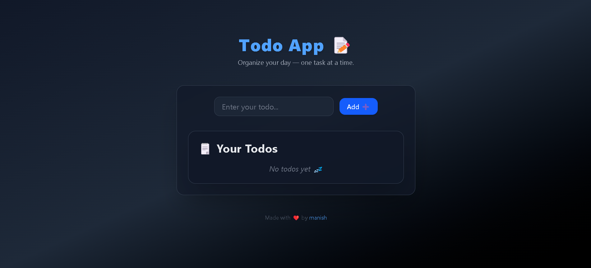

# 📝 Dark Todo App  Redux-toolkit project

A sleek, animated **Todo App** built with **React, TypeScript, Redux Toolkit, Tailwind CSS**, and **Framer Motion**.  
Easily add, update, and delete your todos — all in a modern dark UI.

---

## 🚀 Tech Stack
- ⚛️ React + TypeScript  
- 🧰 Redux Toolkit  
- 🎨 Tailwind CSS  
- ⚡ Framer Motion (animations)

---

## 🖼️ Preview



---

## 🧑‍💻 Run Locally

```bash
# Clone this repo
git clone https://github.com/Manishsaini0607/redux-toolkit

# Go inside
cd todo-app

# Install dependencies
npm install

# Start the app
npm run dev
